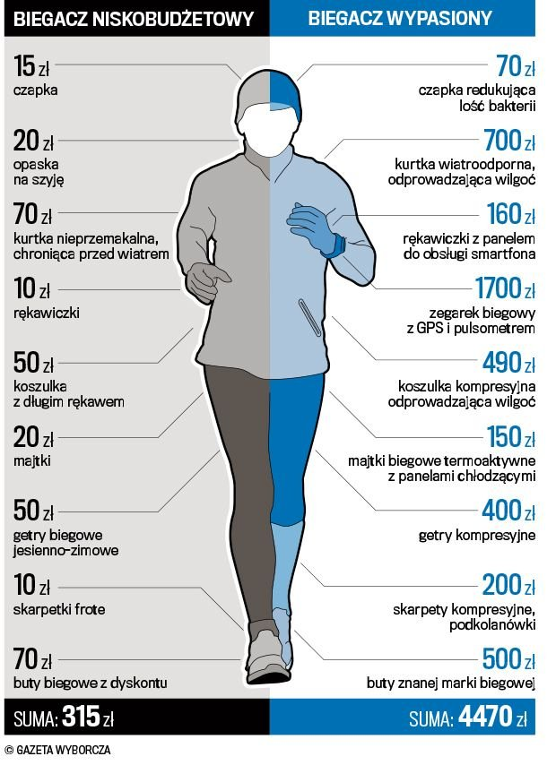
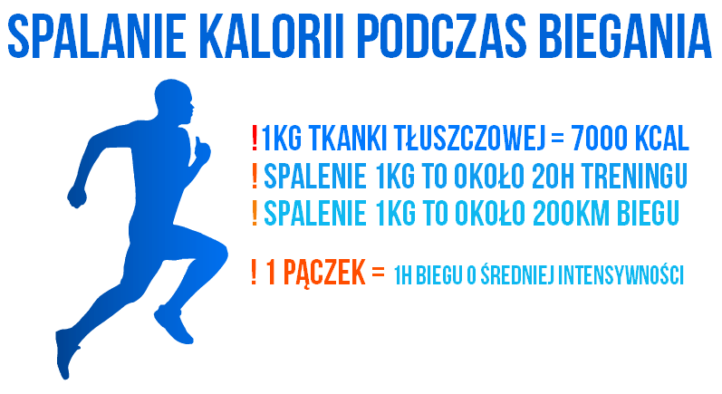

# Running
Blog biegowy

## Bieganie 
Bieganie to prosty sport. Często mówi się, że najprostszy z możliwych. Jednak gdy przeciętny śmiertelnik posłucha rozmowy dwóch, ostro wkręconych w temat biegania, maratończyków to zastanawia się czy faktycznie rozmawiają oni po polsku. Powiedzmy, że jeden mówi tak: >*"Stary! To była rzeźnia. Pejs leciał równo, ale po dwudziestym odezwało się pasmo i żeby zmniejszyć dyskomfort, to starałem się robić lepszą kołyskę. No wiesz – supinować mocniej. Po agrafce wciąłem żelka, żeby nie zderzyć się ze ścianą. Na bufecie złapałem jakieś izo i wodę. Po trzydziestym Garmin pokazywał, że wchodzę już w trzeci zakres, chociaż nie robiłem żadnych głupich interwałów – trzymałem rytm. Powiem ci, że noga już pod koniec nie podawała.Ostatni kilometr biegłem ile fabryka dała, chociaż nie miałem szans na PB. Chyba trochę zaniedbałem core i dlatego w drugiej połówce nie było lekkości…Generalnie fajna impreza. Było z kim biegać…" *

            (źródło: http://trizarza.pl/2014/10/biegowe-terminy/)

            (źródło: http://facet.onet.pl/forma/)
        
Reakreacyjne bieganie dla zdrowia dostarcza organizmowi wielu korzyści. Docenili je już dawno Amerykanie - w samym Nowym Jorku biega więcej ludzi niż w całej Polsce, dzięki temu w USA odnotowano wyraźny spadek liczby zawałów i chorób niedokrwiennych serca. Biegając, możesz zapobiegać osteoporozie, cukrzycy, chorobom serca, nowotworom, nerwicom, depresji i wielu innym cywilizacyjnym zmorom.

## Zanim jednak zaczniesz biegać, kilka porad :thumbsup: :

1. Przebadaj się - podstawowe badania krwi oraz wizyta u dr pozwoli Ci zmniejszyć ryzyko niespodziewanej reakcji organizmu na wysiłek fizyczny.
2. Zgłębiaj wiedzę - czytaj, dopytuj się bardziej doświadczonych znajomych, udaj się do specjalisty.
3. Dobierz odpowiedni strój - przede wszystkim buty, specjaliści w sklepie coraz częściej posiadają sprzęt, którym zbadają to jak biegasz i pozwolą dobrać obuwie tylko dla Ciebie. Wygodne buty to podstawa w bieganiu i to jedyna rzecz, na której nie warto oszczędzać. Dla kobiet równie istotnym będzie stanik biegowy.
4. Określ swój cel biegowy - zrób to jasno, ale realnie np: za 2 miesiące przebiegnę 10 km, albo biegam, aby zgubić 5 kg.
5. Znajdź motywację - by regularnie trenować, dołącz do kogoś lub umów się z kimś, że będziecie razem biegać. Będzie to dla Ciebie motywacja, że musisz wyjść, bo ktoś czeka. Zapisz się na zawody

            (źródło: http://polskabiega.sport.pl/polskabiega/1,105612,16730629,Ile_kosztuje_bieganie_.html)
        
Tak jak widać na powyższym obrazku - bieganie może być naprawdę tanie lub jeśli ktoś lubi gadżety, nowoczesny ubiór i sprzęt. Tak naprawdę wartość ubioru nie jest wyznacznikiem wartości biegacza. Często ten biegacz po prawej to osoba lansująca się, niby wychodzi pobiegać, ale w tym czasie zrobi sobie więcej zdjęć niż przebiegnie kilometrów, a wszystko to dlatego, że bieganie jest modne i chcą mieć dużo "lajków" na portalach społecznościowych

## Kilka cytatów motywacyjnych na temat biegania

>*Kiedy ludzie pytają mnie dlaczego biegam mówię im, że nie ma tak naprawdę powodu. Tylko ta adrenalina na starcie i to uczucie, które towarzyszy Ci, kiedy przekraczasz linię mety i wiesz, że wygrałaś bez względu na to, które zajęłaś miejsce.* Courtney Parsons

>*Bieganie nauczyło mnie, że oddawanie się pasji jest ważniejsze niż sama pasja. Daj się czemuś pochłonąć bez reszty, włóż całe serce, doskonal się i ćwicz, nigdy się nie poddawaj – właśnie na tym polega spełnienie. To jest prawdziwy sukces.* Dean Karnazes

>*Cudem nie jest to, że skończyłem. Cudem jest to, że miałem odwagę aby rozpocząć.* John Bingham

>*W rzeczy samej, my maratończycy, jesteśmy inni niż pozostali ludzie. Jeśli chcesz coś wygrać - biegnij na 100 metrów. Jeśli chcesz czegoś doświadczyć - przebiegnij maraton.* Emil Zatopek

>*Jeśli biegasz jesteś biegaczem. I nie ma znaczenia jak szybko ani jak daleko biegasz. Nie ma znaczenia czy dziś jest Twój pierwszy dzień czy biegasz już dwadzieścia lat. Tu nie ma żadnego testu, licencji ani karty członkowskiej. Po prostu biegasz.* John Bingham
                
                                                                              

            (źródło: http://napieramy.pl/bieganie-17/)

## **Korzyści z biegania:** 

>* ogólnie rzecz ujmując - poprawia zdrowie (zmniejsza ryzyko zawału, cukrzycy, nadciśnieia etc.),
>* świetnie redukuje stres,
>* efektem "ubocznym" jest utrata kilogramów,
>* daje wiele satysfacji,
>* dotlenia organizm i poprawia koncentrację,
>* jest świetnym sposobem na poznawanie nowych ludzi
>* wzmacnia poczucie własnej wartości

## Rekordy biegania

Mężczyźni

| Dystans       | Czas          | Zawodnik    |
| ------------- |:-------------:| --------:|
| 100 m         | 9,58          |Usain Bolt|
| 1,5 km        | 3:26,00       |Hicham El Guerrouj|
| 5 km          | 12:37,35      |Kenenisa Bekele  | 
| 10 km       	| 26:17,53      |Kenenisa Bekele
| 21,975 km     | 58:23         |Zersenay Tadese|
| 42,195 km     | 2:02:57       |Dennis Kimetto   |

Kobiety

| Dystans       | Czas          | Zawodnik     |
| ------------- |:-------------:| --------:|
| 100 m         | 10,49         |Florence Griffith-Joyner|
| 1,5 km        | 3:50,07       |Genzebe Dibaba|
| 5 km          | 14:11,15      | Tirunesh Dibaba| 
| 10 km       	| 29:17,45      | Almaz Ayana|
| 21,975km      | 1:05:06       |Peres Jechirchir|
| 42,195 km     | 2:15:25        | Paula Radcliffe|

            (źródło: https://pl.wikipedia.org/wiki/Rekordy_%C5%9Bwiata_w_lekkoatletyce)

            (źródło: http://dzixonafit.blogspot.com/)
